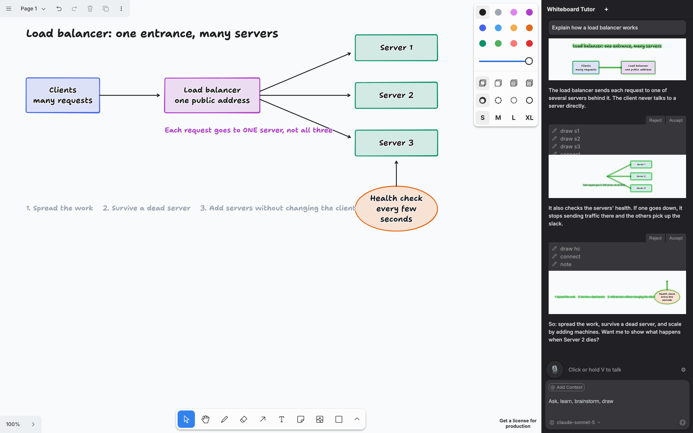

# Whiteboard Tutor

Ask a question out loud. An AI tutor answers in a natural voice while it draws the explanation on a [tldraw](https://tldraw.dev) whiteboard, one idea at a time.



Built on the [tldraw agent starter kit](https://tldraw.dev/starter-kits/agent), which already lets a model read and draw on the canvas. This project adds voice in and out, a tutoring mode that keeps the prompt small, and a cost meter.

## What you need

Two API keys, both in a `.dev.vars` file at the project root:

| Key | Used for |
| --- | --- |
| `OPENAI_API_KEY` | The tutor's voice (`gpt-4o-mini-tts`). Required. Also unlocks the `gpt-5.6-*` models. |
| `ANTHROPIC_API_KEY` | The default model, `claude-opus-5`. Swap for `GOOGLE_API_KEY` if you prefer Gemini. |

A browser with built-in speech recognition: Chrome, Edge or Safari. Firefox works if you switch the ears to OpenAI in the settings drawer.

## Run it

```bash
git clone https://github.com/harjothkhara/whiteboard-tutor
cd whiteboard-tutor
npm install
cp .dev.vars.example .dev.vars   # paste your keys into this file
npm run dev
```

Open http://localhost:5173, click the mic (or hold **V**), and ask something like "explain how a load balancer works."

- Click the mic while the tutor is talking to cut it off.
- Pick the model from the dropdown under the chat box.
- The gear icon in the voice bar opens settings: voice (marin, cedar, and the rest of OpenAI's voices), speed, ears, hands-free mode, and tutor mode.
- One click on the mic starts a **voice chat session**: the mic stays on for the whole conversation (it pauses while the tutor talks, then listens again) until you press the stop button. **✋ Interrupt** cuts the tutor off mid-answer.

## Ask about a link

Paste or say a URL and the tutor reads it before answering: "walk me through https://github.com/kubernetes/website/pull/57530". GitHub pull requests and issues are read through the GitHub API (title, description, changed files, a trimmed diff); other pages are reduced to plain text. Content is capped at a few thousand tokens per link, up to three links per question. Set `GITHUB_TOKEN` in `.dev.vars` if you hit GitHub's 60-requests-per-hour anonymous limit.

## Boards and folders

The ☰ button in the chat header opens the boards drawer. Every board has its own canvas and its own chat history, saved in your browser.

- **+ Board** makes a new empty board and opens it. **+ Folder** makes a folder.
- Double-click a board or folder name to rename it.
- Use the small dropdown on a board to move it into a folder, for example a folder called "Algorithms" holding "Dijkstra" and "Linked lists".
- The trash icon deletes a board and its drawing and chat. The last board can't be deleted.

## How it works

1. Your speech becomes text in the browser and is sent to the agent like a typed message.
2. The model streams back actions: `message` (say this), `create` (draw this), `label`, `move`, and so on.
3. Each finished `message` is sent to OpenAI text-to-speech and played. Drawing actions keep landing on the canvas while the sentence plays.
4. In tutor mode the system prompt tells the model to say one short idea, draw it, say the next, and to keep diagrams to about a dozen shapes inside your viewport.

## What it costs

| Piece | What runs | Cost |
| --- | --- | --- |
| Ears | Browser speech recognition | free |
| Voice | OpenAI `gpt-4o-mini-tts` | about $0.015 per minute the tutor talks |
| Brain | `claude-opus-5` in tutor mode | tokens only, mostly cached after the first turn |

There is no realtime voice API in the loop. That is the expensive part of most voice demos (roughly $0.06 to $0.11 per minute). Here you pay nothing while you talk and about a cent and a half per minute while the tutor talks.

Tutor mode removes the canvas **screenshot** from every request. The model still knows every shape in your viewport, but as a few lines of text instead of an image. It also drops actions a tutor never uses, so the schema in the system prompt is shorter, and it runs the model at low reasoning effort with a 4k output cap. The browser sends about 2 KB per turn; the worker adds the system prompt and schema on top (a few thousand tokens, cached after the first turn). Chat history is resent every turn and is not yet compacted, so long lessons grow. Use the meter to watch it.

The meter in the chat header shows requests, tokens, cache hit rate, and an estimated spend for the Claude models.

Ways to spend less:

- Switch to `claude-sonnet-5` or `claude-haiku-4-5` for routine explanations.
- Start a new chat (the **+** button) when you change topic. History is part of every request.
- Keep the viewport tight. Shapes outside it are summarized, not listed.

There is no browser-voice fallback on purpose. If the OpenAI voice call fails, the voice bar shows an error and nothing is spoken.

## Deploy

The backend is a Cloudflare Worker with a SQLite Durable Object (one per browser session), which works on the free plan. Build, deploy, then set the keys as secrets:

```bash
npm run deploy
npx wrangler secret put OPENAI_API_KEY --config dist/whiteboard_tutor/wrangler.json
npx wrangler secret put ANTHROPIC_API_KEY --config dist/whiteboard_tutor/wrangler.json
npx wrangler secret put ACCESS_TOKEN --config dist/whiteboard_tutor/wrangler.json   # recommended, see below
```

### Lock it down before sharing a URL

The three API routes (`/stream`, `/tts`, `/transcribe`) spend your credits. Two switches protect them:

- **`ACCESS_TOKEN`**: when set, every request must send it as a bearer token. Paste the same value into the settings drawer (gear icon, "Access token") in each browser you use. Pick something long and random.
- **`ALLOWED_ORIGINS`**: comma-separated list of origins allowed to call the API. Defaults to the worker's own origin. Local dev on localhost is always allowed.

Uploads to `/transcribe` are capped at 5 MB and `/tts` text at 4,000 characters. There is no per-user rate limit yet, so the token is what stands between a leaked URL and your bill.

## Project layout

Files added on top of the starter kit:

```
client/voice/VoiceSettings.ts            settings, saved in localStorage
client/voice/stt.ts                      browser and OpenAI speech-to-text
client/voice/tts.ts                      OpenAI text-to-speech queue
client/voice/VoiceController.ts          mic -> agent, chat history -> speaker, hands-free loop
client/components/VoiceBar.tsx           mic button, status line, settings drawer
client/boards/BoardStore.ts              named boards and folders, per-board persistence keys
client/components/BoardsDrawer.tsx       the boards drawer (create, rename, move, delete)
client/components/UsageMeter.tsx         tokens and cost meter
client/agent/managers/AgentUsageManager.ts
client/modes/AgentModeDefinitions.ts     the `tutor` mode (no screenshot)
worker/prompt/sections/tutor-section.ts  how the tutor is told to teach
worker/routes/tts.ts                     proxy to gpt-4o-mini-tts
worker/routes/transcribe.ts              proxy to gpt-4o-mini-transcribe
worker/do/AgentService.ts                emits a `{ usage }` event after each request
```

Everything else is the starter kit as shipped. Its README covers parts, actions, modes and custom shapes: https://tldraw.dev/starter-kits/agent.

To change how the tutor teaches, edit `worker/prompt/sections/tutor-section.ts`. To change what it can see or do, edit the `tutor` entry in `client/modes/AgentModeDefinitions.ts`.

## Contributing

See [CONTRIBUTING.md](CONTRIBUTING.md). Ideas that would help most: a step-by-step "teach mode" with clickable lesson cards, and an opt-in realtime voice mode for people who want a phone-call feel.

## License

MIT, see [LICENSE.md](LICENSE.md). The starter kit is copyright tldraw Inc., also MIT. tldraw itself is used under the [tldraw license](https://tldraw.dev/legal/tldraw-license); a watermark is shown unless you have a license.
